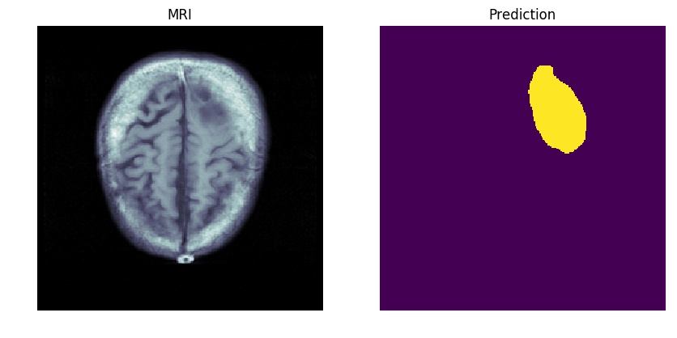

# MRI_methylation
predicting methylation status in glioblastoma patients using convolutional neural networks

Follow these steps to train to segmentation model to isolate tumours in the t1 modality of an MRI scan and use the results of that model to train a classification model to predict the mathylation status of glioblastoma patients

Steps:
1. Download the TCGA data for methylation in the gene MGMT in brain cancer patients from the National Cancer Institute Portal http://bit.ly/2RYyDHR into the Methylation/data directory

2. Go to the [Medical Segmentation Decathlon](http://medicaldecathlon.com) website and download the [BraTS subset] (https://drive.google.com/file/d/1A2IU8Sgea1h3fYLpYtFb2v7NYdMjvEhU/view?usp=sharing) into the Brats/data directory. The dataset has the [Creative Commons Attribution-ShareAlike 4.0 International license](https://creativecommons.org/licenses/by-sa/4.0/)

3. Explore TCGA-GBM data-set with exploratory_analysis.ipynb

4. Preprocess TCGA-GBM data-set with preprocess_tcga_gbm.ipynb. Preprocessing is done on the fly during training but this notebook will save comparisons between original and preprocessed images.

Preprocessing is done by applying the slope and intercept found in the dicom meta-data to the pixel values to return Hounsfield Units. Following this, a window is applied to the pixel data and pixel values lower and higher than the min and max window values are set to the min and max window values, respectively.

Although the pixel values differ there seems to be no noticable visual difference

4. Explore BRATS data-set with segmentation_unet_explore.ipynb

5. Train Brats Segmentation Model with U-Net backbone, followed by using the trained model to predict on the TCGA dataset with tumour_unet_seg.ipynb.

Example Output from Segmentation Model applied on BRATS testing set

Credit to this wonderful repository for making this happen so seamlessly --> https://github.com/IntelAI/unet/tree/master/2D

6. Train Methylation Model with ResNet-50 backbone with methylation_training.ipynb

Training is done on the frames in the TCGA data-set which the BRATS U-Net model found a presence of a tumour.
Higher accuracies are expected by isolating the tumour from each frame and using that as input to the methylation model. Such an approach remains to be investigated.

The final prediction is on a video level and is done by using a majority rules rule which consists of predicting a methylation status of true if the majority of frames are predicted to have a positive methylation status and False otherwise.

Example Output from Segmentation Model applied on TCGA dataset 

